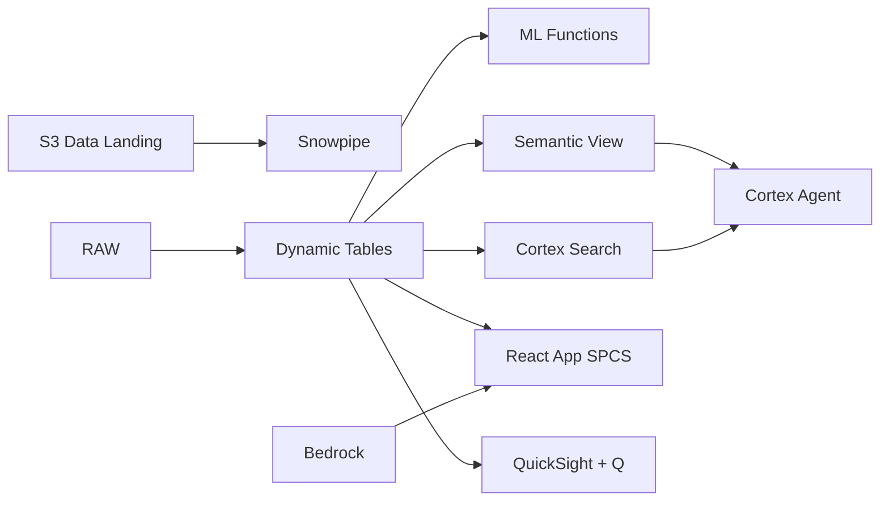

# Supply Chain Traceability

Plantation-to-refinery traceability for the world's largest palm oil producer — Dynamic Tables build chain-of-custody across 300 mills, Iceberg enables buyer self-service via Athena, and Row Access Policies enforce trader-level data segregation.

## Architecture

Indonesia produces 60% of the world's palm oil across thousands of mills in Sumatra and Kalimantan. International buyers require full plantation-to-port traceability and NDPE compliance proof under upcoming EUDR regulations. Twelve mills are below the 95% traceability threshold, and mass balance reconciliation flags 7 mills with suspicious variance. With 5,000 smallholders in the supply chain, visibility requires automation at scale.



## Snowflake Capabilities

| Capability | Implementation |
|-----------|---------------|
| Dynamic Tables | FULL_CHAIN_OF_CUSTODY / MILL_TRACEABILITY_SCORE / BUYER_SUPPLY_CHAIN_VIEW / MASS_BALANCE_RECONCILIATION |
| ML Functions | ML.ANOMALY_DETECTION |
| Cortex AI | AI_PARSE_DOCUMENT, SUMMARIZE, AI_CLASSIFY |
| Cortex Search | 500 documents indexed |
| Cortex Agent | TRACEABILITY_AGENT |
| Semantic View | TRACEABILITY_ANALYTICS |
| React App (SPCS) | 5 tabs + DemoGuide |


## AWS Services

| Service | Role in Demo |
|---------|-------------|
| Amazon S3 | Store audit reports, certification documents, and satellite imagery |
| Apache Iceberg (on S3) | Open table format for buyer self-service access |
| AWS Glue | Catalog and transform supply chain data for Athena queries |
| AWS Lake Formation | Fine-grained access control for buyer-level data segregation |
| Amazon Bedrock (Claude) | Summarize audit findings and generate compliance narratives |
| Amazon QuickSight + Q | Supply chain visibility dashboard with natural language queries |


## Personas

| Persona | Role | Key Questions |
|---------|------|---------------|
| **Budi Santoso** | VP Supply Chain | "What percentage of our CPO is traceable to plantation?" "Which mills have incomplete chain-of-custody?" |
| **Ratna Dewi** | Sustainability Auditor | "Show me the chain-of-custody for shipment SHP-2024-1247." "Which mills failed mass balance reconciliation?" |


## Data

| Table | Rows | Description |
|-------|------|-------------|
| MILLS | 300 | Palm oil mills across Sumatra and Kalimantan with GPS coordinates and ISPO status |
| SHIPMENTS | 60,000 | CPO and PKO shipments from mill to refinery to port |
| CHAIN_OF_CUSTODY | 150,000 | Custody transfer records linking smallholder to mill to buyer |
| CERTIFICATIONS | 8,000 | ISPO, RSPO, and ISCC certifications per mill and supplier |
| AUDIT_REPORTS | 500 | Third-party audit reports, mass balance reconciliations, and findings |
| BUYERS | 80 | International buyers with sustainability requirements and data access scope |
| SMALLHOLDERS | 5,000 | Independent smallholders feeding into each mill catchment area |


## Build Instructions

### Prerequisites
- Snowflake account with ACCOUNTADMIN access
- Cortex AI enabled (ML Functions, Search, Agent)
- Warehouse: TRACEABILITY_WH (Medium)
- AWS CLI with access (us-west-2)

### Deployment

```bash
snowsql -f snowflake/00_setup.sql
snowsql -f snowflake/01_marketplace_install.sql
snowsql -f snowflake/02_raw_tables.sql
snowsql -f snowflake/03_staging.sql
snowsql -f snowflake/04_dynamic_tables.sql
snowsql -f snowflake/05_search.sql
snowsql -f snowflake/06_ml_models.sql
snowsql -f snowflake/07_semantic_view.sql
snowsql -f snowflake/08_agent.sql
```

### React App (SPCS)
```bash
cd app && npm ci && npm run build
docker build -t aws-indonesia-palm-oil-traceability-app .
docker push bdiqc8sm-default.registry.snowflakecomputing.com/palm_oil_traceability_id/app/aws_indonesia_palm_oil_traceability/app:latest
```

### Demo Mode
Open the app URL with `?demo=true` for presenter view.

## Build Modes

### Snowflake Only
Run scripts 00-08 (skip AWS-specific integration). Uses:
- **Snowflake Internal Stage + Iceberg Tables** instead of Amazon S3
- **Snowflake-managed Iceberg Tables** instead of Apache Iceberg (on S3)
- **Dynamic Tables** instead of AWS Glue
- **Row Access Policies** instead of AWS Lake Formation
- **Cortex Complete** instead of Amazon Bedrock (Claude)
- **Snowflake Intelligence (Cortex Analyst)** instead of Amazon QuickSight + Q

### Full AWS + Snowflake
Run all scripts including AWS integration. Deploy QuickSight dashboard from `quicksight/`.

## Business Impact

Industry research and Snowflake customer outcomes:
- **Indonesia produced 51.3 million tonnes of CPO in 2023 — 60% of global output** — [GAPKI](https://gapki.id/)
- **EU Deforestation Regulation (EUDR) requires full traceability by Dec 2025 for all palm oil imports** — [European Commission](https://environment.ec.europa.eu/topics/forests/deforestation_en)
- **Indonesia has 2.67 million palm oil smallholders managing 41% of planted area** — [World Bank](https://www.worldbank.org/en/country/indonesia)
- **Traceable palm oil commands 8-15% price premium over non-traceable in EU markets** — [RSPO](https://rspo.org/impact/)


## Key Demo Numbers

- **300 mills** tracked across Sumatra and Kalimantan
- **150,000 records** chain-of-custody entries maintained in real-time
- **97.8% traceable** volume traceable to smallholder level
- **Rp 142T** traced export volume this year
- **500 audit reports** searchable via Cortex Search
- **5,000 smallholders** in supply chain across Sumatra and Kalimantan


## License

Apache 2.0 — See [LICENSE](LICENSE) for details.

This is a personal demo project and is not an official Snowflake offering. It comes with no support or warranty.