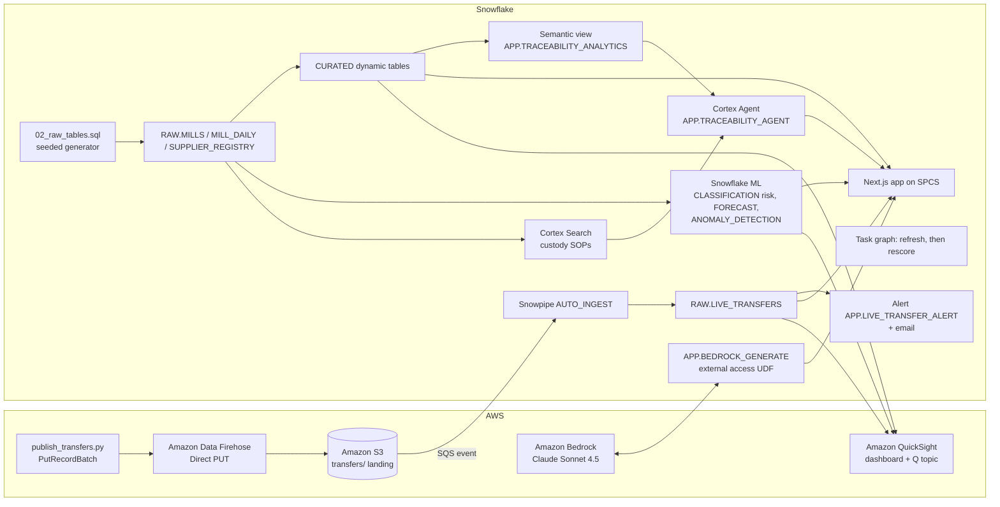

# Indonesia Palm Oil Mill-to-Refinery Traceability

End-to-end chain-of-custody analytics for **40 palm oil mills in a fictional crude palm oil (CPO) supply chain across 8 Indonesian cities** (Pekanbaru, Medan, Jambi, Palembang, Bengkulu, Pontianak, Sampit, Samarinda) and 5 sourcing models, using Snowflake, optionally with AWS: from a live mill-to-refinery CPO custody transfer to a 7-day custody-break risk score, a custody alert email and an AI action memo for the head of supply chain traceability. Custody checks are demo signals on synthetic data, not audit or certification verdicts.

## Architecture

A chain-of-custody pipeline built on **Snowflake** (Dynamic Tables, Snowflake ML, Cortex Search, Cortex Agent, Cortex AI_COMPLETE, SPCS) and, in the full build, **AWS** (Amazon Data Firehose, Amazon S3, Bedrock Claude, QuickSight + Amazon Q). CPO custody-transfer events land in `RAW.LIVE_TRANSFERS`. Dynamic tables curate 90 days of mill-day history: CPO custody transfers and tonnes dispatched, tonnes traceable to a plantation, custody flags, confirmed custody breaks, lots held at the refinery, mass-balance reconciliations and FFB supplier registry coverage. Snowflake ML scores 7-day custody-break risk per mill, forecasts network-wide CPO custody transfers and flags mass-balance variance anomalies. A Cortex Agent answers questions with SOP citations, and an LLM drafts the action memo.

Interactive diagrams (hover for object names): [Snowflake only](docs/architecture-snowflake.html) | [AWS + Snowflake](docs/architecture-aws.html). The app shows both on its Architecture & Data tab, the current build first. Regenerate them with `python3 docs/build_architecture.py aws snowflake`.


```mermaid
flowchart LR
    subgraph AWS
      PUB[publish_transfers.py<br/>PutRecordBatch] --> FH[Amazon Data Firehose<br/>Direct PUT]
      FH --> S3[(Amazon S3<br/>transfers/ landing)]
      BR[Amazon Bedrock<br/>Claude Sonnet 4.5]
      QS[Amazon QuickSight<br/>dashboard + Q topic]
    end
    subgraph Snowflake
      S3 -->|SQS event| PIPE[Snowpipe AUTO_INGEST] --> LIVE[RAW.LIVE_TRANSFERS]
      GEN[02_raw_tables.sql<br/>seeded generator] --> RAW[RAW.MILLS / MILL_DAILY / SUPPLIER_REGISTRY]
      RAW --> DT[CURATED dynamic tables]
      RAW --> ML[Snowflake ML<br/>CLASSIFICATION risk, FORECAST,<br/>ANOMALY_DETECTION]
      DT --> SV[Semantic view<br/>APP.TRACEABILITY_ANALYTICS]
      RAW --> CS[Cortex Search<br/>custody SOPs]
      SV --> AG[Cortex Agent<br/>APP.TRACEABILITY_AGENT]
      CS --> AG
      LIVE --> AL[Alert APP.LIVE_TRANSFER_ALERT<br/>+ email]
      UDF[APP.BEDROCK_GENERATE<br/>external access UDF]
      TK[Task graph: refresh, then rescore]
      APP[Next.js app on SPCS]
    end
    BR <--> UDF
    DT --> APP
    ML --> APP
    LIVE --> APP
    AG --> APP
    UDF --> APP
    DT --> QS
    ML --> QS
    LIVE --> QS
```

The Snowflake-only build drops the AWS subgraph: `APP.SIMULATE_TRANSFERS` writes to `RAW.LIVE_TRANSFERS`, and the app calls Cortex `AI_COMPLETE` instead of the Bedrock UDF.

## Snowflake Capabilities

| Capability | Implementation |
|-----------|---------------|
| Dynamic Tables | `CURATED.KPI_SUMMARY`, `PERFORMANCE_SUMMARY`, `SIGNAL_SUMMARY`, `TREND_ANALYSIS` from the RAW tables |
| Snowflake ML | CLASSIFICATION 7-day custody-break risk (`ML.CUSTODY_RISK_SCORES`), 14-day CPO custody-transfer FORECAST, mass-balance variance ANOMALY_DETECTION |
| Cortex Search | 11 synthetic chain-of-custody follow-up SOPs (one per sourcing model and custody signal) in `SEARCH.CUSTODY_SOP_SEARCH` |
| Semantic View | `APP.TRACEABILITY_ANALYTICS` over mills, custody signals, daily totals and risk |
| Cortex Agent | `APP.TRACEABILITY_AGENT`: Cortex Analyst over the semantic view plus Cortex Search for SOP citations |
| Cortex AI | `AI_COMPLETE('claude-sonnet-4-5')` for grounded answers, and for the action memo in the Snowflake-only build |
| Alerts + Tasks | `APP.LIVE_TRANSFER_ALERT` logs FLAG events and sends email; task graph `TASK_REFRESH_CURATED`, then `TASK_RESCORE_RISK` |
| Snowpark Container Services | Next.js app `APP.ID_PALM_OIL_TRACEABILITY_APP` with 6 tabs: Executive Cockpit, Predictive, Supplier Registry, Live Transfers, Ask AI, Architecture & Data |
| Snowpipe | `RAW.LIVE_TRANSFERS_PIPE` AUTO_INGEST from S3 (AWS build only) |

## AWS Services

Used only in the AWS + Snowflake build.

| Service | Role in Demo |
|---------|-------------|
| Amazon Data Firehose | Direct PUT stream `id-palm-oil-traceability-transfers`: `aws/publish_transfers.py` sends CPO custody-transfer events with PutRecordBatch; Firehose buffers up to 60 s or 1 MB and writes newline-delimited JSON to S3 |
| Amazon S3 | Landing bucket (`transfers/`). An event notification goes to the Snowpipe SQS queue; Firehose errors go to `firehose-errors/` |
| Amazon Bedrock | Claude Sonnet 4.5 writes the action memo, called from Snowflake through an external-access UDF |
| Amazon QuickSight | DIRECT_QUERY executive dashboard over Snowflake (daily CPO custody transfers and custody flags, confirmed custody breaks by mill, custody-break risk) |
| Amazon Q | Natural-language questions over the QuickSight topic `id-palm-oil-traceability-topic` |
| AWS IAM | Least-privilege roles for Snowflake S3 reads and Firehose S3 writes, and a Bedrock-only invoke user |

## Personas

These personas are fictional.

| Persona | Role | Key Questions |
|---------|------|---------------|
| **Sari Wulandari** | Head of Supply Chain Traceability | "How much of our dispatched CPO is traceable to a plantation, by sourcing model?" "Which custody signals lead to confirmed custody breaks?" |
| **Agus Pratama** | Custody Analyst | "Which mills are high risk this week, and which SOP applies?" |

## Data

All data is synthetic and seeded, so every rebuild reproduces it. The supply chain, mills and names are fictional; the cities are real places used only as labels, and nothing here describes a real company or site.

| Table | Rows | Description |
|-------|------|-------------|
| RAW.MILLS | 40 | Mills: every combination of 8 cities and 5 sourcing models (integrated estate mill, plasma scheme mill, smallholder-sourced mill, dealer-supplied mill, toll-processing mill), with risk tier, years in the traceability programme and size |
| RAW.MILL_DAILY | 3,600 | Daily mill observations over 90 days: CPO custody transfers, CPO and traced tonnes, custody flags, confirmed custody breaks, lots held, custody signal, mass-balance reconciliations due and received, mass-balance variance and untraced shares. Includes two area-wide weighbridge system outage days (Pekanbaru and Sampit) |
| RAW.SUPPLIER_REGISTRY | 40 | Registered FFB suppliers, suppliers with a verified plantation link on file and verifications pending per mill |
| SEARCH.CUSTODY_SOP_DOCS | 11 | Synthetic chain-of-custody follow-up SOPs indexed for Cortex Search (not audit or certification guidance) |
| RAW.LIVE_TRANSFERS | Grows during the demo | Live CPO custody-transfer events from Firehose and S3 (AWS build) or `APP.SIMULATE_TRANSFERS` (Snowflake-only build) |
| ML.CUSTODY_RISK_SCORES | 40 | 7-day custody-break probability and risk band per mill |

## Build Instructions

### Prerequisites
- Snowflake account with ACCOUNTADMIN access, and Cortex AI enabled (AI_COMPLETE, Search, Agent).
- An X-Small warehouse with auto-suspend at or below 120 s, and an existing SPCS compute pool.
- Python 3.11+, `snowflake-connector-python`, Node.js 22+, Docker and the `snow` CLI.
- App image: run `snow spcs image-registry login`, then build and push `id-palm-oil-traceability-app:v1` to the database's `APP.IMAGES` repository (see the header of `snowflake/07_deploy_app.sql`).
- AWS build only: `boto3`, AWS credentials for the target account (us-west-2) with Firehose and Bedrock access, and QuickSight Enterprise.

### SPCS App
```
<DATABASE>.APP.ID_PALM_OIL_TRACEABILITY_APP
```

### Tests
```bash
python -m pytest aws snowflake quicksight
```

For a local run, put `SNOWFLAKE_ACCOUNT`, `SNOWFLAKE_USER`, `SNOWFLAKE_DATABASE`, `SNOWFLAKE_WAREHOUSE`, `SNOWFLAKE_AUTHENTICATOR=PROGRAMMATIC_ACCESS_TOKEN`, `SNOWFLAKE_TOKEN` and `DEMO_PLATFORM` in the environment, then run `npm --prefix app run build && npm --prefix app start`.

## Build Modes

Both modes share the same core. They differ in three places, and the app's `DEMO_PLATFORM` setting (in its SPCS spec) switches the memo provider and the Live Transfers tab.

| Layer | Snowflake Only | Full AWS + Snowflake |
|---|---|---|
| Live transfers | `CALL APP.SIMULATE_TRANSFERS(n)` inserts simulated CPO custody-transfer events into `RAW.LIVE_TRANSFERS`. This simulates a mill dispatch feed; it is not Snowpipe Streaming | `aws/publish_transfers.py` sends custody-transfer events to Amazon Data Firehose, which writes them to S3, then SQS and Snowpipe AUTO_INGEST |
| Action memo | Cortex `AI_COMPLETE('claude-sonnet-4-5')` | Amazon Bedrock Claude Sonnet 4.5 through `APP.BEDROCK_GENERATE` |
| BI and natural-language questions | The SPCS app is the dashboard; questions go to the Cortex Agent | Also a QuickSight dashboard and an Amazon Q topic |
| App setting | `DEMO_PLATFORM: snowflake` | `DEMO_PLATFORM: aws` |

### Snowflake Only

```bash
# 1. Core data and dynamic tables (guarded: new isolated database only)
python snowflake/run_core.py --database INDONESIA_PALM_OIL_TRACEABILITY_SNOWFLAKE --warehouse <XS_WAREHOUSE> --connection <CONNECTION> --apply
# 2. Native custody-transfer feed, ML, search, semantic view, agent, alert and task graph
python snowflake/run_intelligence.py --database INDONESIA_PALM_OIL_TRACEABILITY_SNOWFLAKE --platform snowflake --warehouse <XS_WAREHOUSE> --connection <CONNECTION> --alert-email <ALERT_EMAIL>
# 3. App on SPCS with DEMO_PLATFORM=snowflake (push the image first)
python snowflake/run_intelligence.py --database INDONESIA_PALM_OIL_TRACEABILITY_SNOWFLAKE --platform snowflake --warehouse <XS_WAREHOUSE> --connection <CONNECTION> --alert-email <ALERT_EMAIL> --files 07_deploy_app.sql --compute-pool <COMPUTE_POOL>
```

During the demo:
- Run `CALL APP.SIMULATE_TRANSFERS(20)` to add live custody-transfer events. For a continuous feed, run `ALTER TASK APP.TASK_SIMULATE_TRANSFERS RESUME`, and `SUSPEND` it afterwards.
- Run `EXECUTE ALERT APP.LIVE_TRANSFER_ALERT` to raise the custody alert email.
- Run `EXECUTE TASK APP.TASK_REFRESH_CURATED` to refresh the curated tables and rescore custody-break risk.

Afterwards, drop the database or run `ALTER SERVICE APP.ID_PALM_OIL_TRACEABILITY_APP SUSPEND`.

### Full AWS + Snowflake

```bash
# 1. Core data and dynamic tables (guarded: new isolated database only)
python snowflake/run_core.py --database INDONESIA_PALM_OIL_TRACEABILITY_AWS --warehouse <XS_WAREHOUSE> --connection <CONNECTION> --apply
# 2. AWS ingestion and Bedrock (dry run first, then --apply)
python aws/setup_aws.py --database INDONESIA_PALM_OIL_TRACEABILITY_AWS --account <AWS_ACCOUNT_ID> --connection <CONNECTION> --apply
# 3. ML, search, semantic view, agent, alert and task graph
python snowflake/run_intelligence.py --database INDONESIA_PALM_OIL_TRACEABILITY_AWS --platform aws --warehouse <XS_WAREHOUSE> --connection <CONNECTION> --alert-email <ALERT_EMAIL>
# 4. App on SPCS with DEMO_PLATFORM=aws (push the image first)
python snowflake/run_intelligence.py --database INDONESIA_PALM_OIL_TRACEABILITY_AWS --platform aws --warehouse <XS_WAREHOUSE> --connection <CONNECTION> --alert-email <ALERT_EMAIL> --files 07_deploy_app.sql --compute-pool <COMPUTE_POOL>
# 5. QuickSight dashboard and Q topic (needs an existing Snowflake data source)
python quicksight/build_dashboards.py --database INDONESIA_PALM_OIL_TRACEABILITY_AWS --account <AWS_ACCOUNT_ID> --principal-arn <QUICKSIGHT_USER_ARN> --data-source-arn <DATA_SOURCE_ARN> --prefix id-palm-oil-traceability --apply --update --with-topic
```

QuickSight objects must be shared with the QuickSight user who signs in (`--principal-arn`); otherwise the console shows nothing.

During the demo:
- Run `python aws/publish_transfers.py --count 20` to send a batch of live custody-transfer events to Firehose. Firehose delivers them to S3 within about 60 seconds, and Snowpipe loads them shortly after.
- Run `EXECUTE ALERT APP.LIVE_TRANSFER_ALERT` to raise the custody alert email.
- Run `EXECUTE TASK APP.TASK_REFRESH_CURATED` to refresh the curated tables and rescore custody-break risk.

Afterwards, `python aws/teardown_aws.py --database INDONESIA_PALM_OIL_TRACEABILITY_AWS --account <AWS_ACCOUNT_ID> --connection <CONNECTION> --apply` removes the AWS resources (Firehose stream, bucket, roles, Bedrock user) and the account-level Bedrock external-access and S3 storage integrations. It leaves the email integration `ID_PALM_OIL_TRACEABILITY_EMAIL_INT`, which the Snowflake-only build also uses.

## Business Impact

Regulatory context and Snowflake customer outcomes:
- **The EU Deforestation Regulation (EUDR) requires that, from 30 December 2026, products placed on, sold within, or exported from the EU are free from deforestation**, and the commodities it covers include palm oil -- [European Commission Green Forum, Implementing the EUDR](https://green-forum.ec.europa.eu/nature-and-biodiversity/deforestation-regulation-implementation_en)
- **Non-EU producers and companies may still be asked to provide information, such as the locations where products were grown, harvested or raised**, to help EU-based companies meet their requirements -- [European Commission Green Forum, Implementing the EUDR](https://green-forum.ec.europa.eu/nature-and-biodiversity/deforestation-regulation-implementation_en)
- **Honeywell** (Snowflake customer) transitioned from managing 33 separate enterprise data warehouses to a unified Snowflake AI Data Cloud, which has improved its ability to manage a complex supply chain with thousands of suppliers -- [Snowflake customer story: Honeywell](https://www.snowflake.com/en/customers/all-customers/video/honeywell/)

## Key Demo Numbers

These figures are synthetic and come from the seeded demo data. Forecast and anomaly figures can shift slightly with the build day.

- **40 mills** (8 cities x 5 sourcing models), 3,600 mill-days over 90 days: **48,712 CPO custody transfers** and 1,290.1 kt of CPO dispatched, with **79.8% traceable to a plantation**. By sourcing model, integrated estate mills trace highest (93.2%) and dealer-supplied mills lowest (59.8%)
- **569 custody flags** and **124 confirmed custody breaks**, so flag precision is 21.8%; **61 lots** held at the refinery. The mill with the most confirmed breaks is MILL-0034 Jambi Toll-processing mill (24)
- **Mass balance variance** produces the most confirmed breaks (29 of 84 flags); the 10 weighbridge system outage flags are never confirmed
- **Custody-break risk model** out-of-time holdout (600 mill-days): precision 0.26, recall 0.23 at a 0.5 threshold, against a 0.15 base rate. Six mills are high risk; the top one is MILL-0024 Pekanbaru Dealer-supplied mill, at 88.9%
- **14-day CPO custody-transfer forecast** of about 526-540 transfers per day, with prediction intervals; **45 of 640** mill-days flagged as mass-balance variance anomalies
- **Mass-balance reconciliation rate 78.4%**, supplier link coverage 69.0% of 15,522 registered FFB suppliers, with 1,030 supplier verifications pending
- **11 SOPs** indexed for Cortex Search and cited by ID in agent answers

## License

Apache 2.0 — See [LICENSE](LICENSE) for details.

This is a personal demo project and is not an official Snowflake offering. It comes with no support or warranty. It is not legal, audit or certification advice. Regulatory statements are taken from the cited European Commission page, and customer outcomes from the cited Snowflake customer story; they are not guarantees of results.
